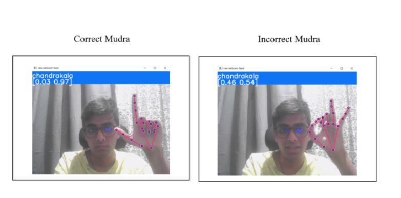
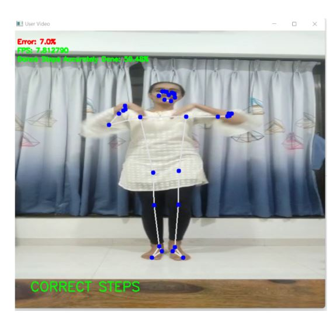
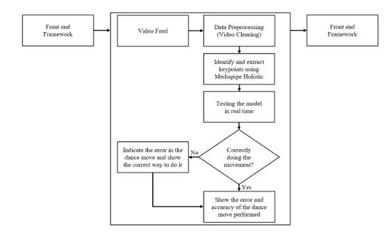
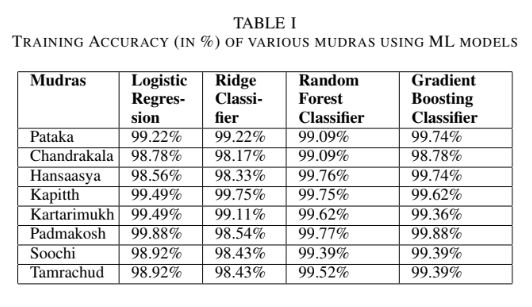

# Kathak Dance Movement Recognition and Correction Using Google's Mediapipe

## Project Overview

This project, undertaken from September 2022, focuses on Kathak dance movement recognition and correction using Google's Mediapipe technology. We have developed a real-time posture detection system that offers a learning software solution for Indian classical dance. This system tracks body, hand, and facial landmarks from video frames using Python and OpenCV. The results of this project have been significant and have been recognized by the academic community with the acceptance of a detailed technical paper by the 14th ICCCNT IEEE Conference.

## Key Objectives

- **Real-time Posture Detection:** The core objective of this project is to detect and recognize Kathak dance movements in real time. This provides an invaluable tool for learners and instructors to ensure correct form and alignment.

- **Learning Software:** By tracking body, hand, and facial landmarks, we've created a learning software that offers insights and corrections for dancers, helping them refine their skills.

- **Academic Recognition:** Our research and development in this area have been recognized and accepted in the academic world, with a technical paper accepted at the 14th ICCCNT IEEE Conference.

## Technical Paper

We are pleased to share that our work in this project has resulted in a detailed technical paper that delves into our methodology, findings, and contributions. The paper includes the following sections:

- **Introduction:** An overview of the project, its significance, and the problem it aims to solve.

- **Methodology:** A detailed explanation of the tools and techniques used in posture detection and correction.

- **Results:** An analysis of the results and the effectiveness of the system in recognizing and correcting Kathak dance movements.

- **Conclusion:** A summary of the project's achievements and potential future directions.

**Contact:**

If you have any questions, suggestions, or would like to collaborate on this project, please feel free to reach out to us:

- Email: glendhingra27@gmail.com

